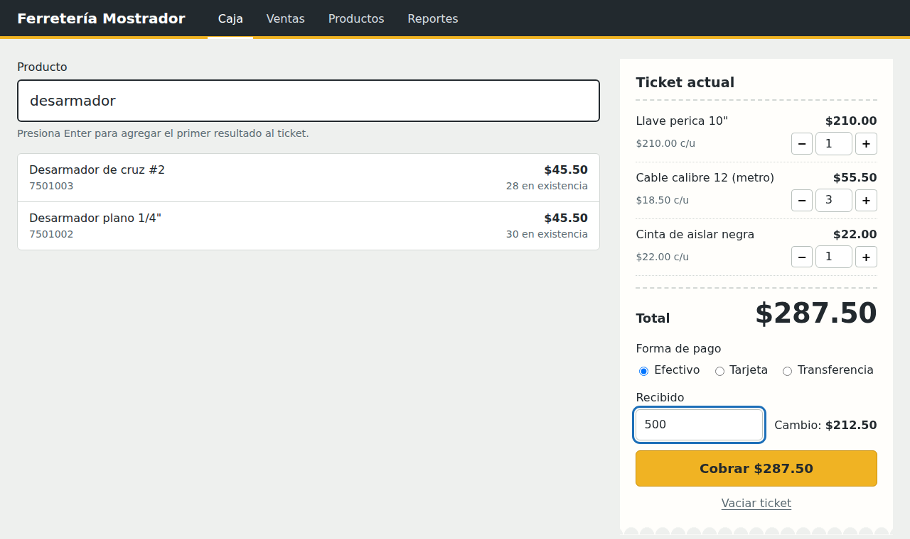
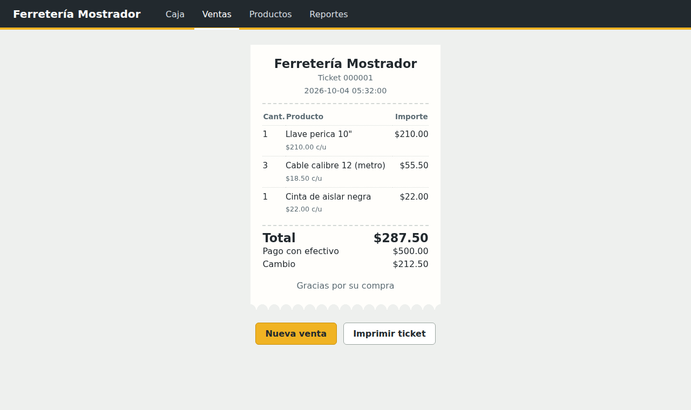
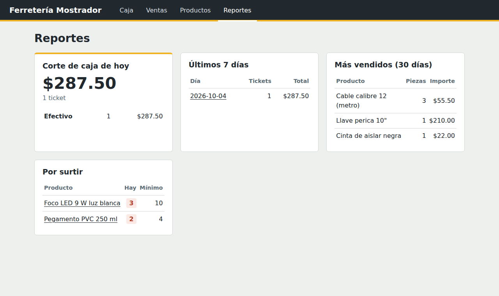

# Mostrador · Punto de venta web para ferretería

Sistema de punto de venta (POS) hecho con **Python, Flask y SQLite**. Es la versión web de un punto de venta que diseñé, programé e implementé en Python con Tkinter, y que se usa a diario en una ferretería real.



## Qué hace

- **Caja rápida:** busca productos por nombre o con el lector de código de barras (Enter agrega al ticket), ajusta cantidades y cobra en efectivo, tarjeta o transferencia con cálculo de cambio.
- **Inventario:** alta, edición y baja de productos. Cada venta descuenta existencias automáticamente y el sistema avisa cuando un producto llega a su stock mínimo.
- **Ticket imprimible** para cada venta.
- **Historial de ventas** por día.
- **Reportes:** corte de caja del día por forma de pago, ventas de los últimos 7 días, productos más vendidos y lista de productos por surtir.
- **API REST en JSON** para buscar productos y registrar ventas desde otros sistemas.

| Ticket | Reportes |
|---|---|
|  |  |

## Decisiones técnicas

- **Dinero en centavos (enteros).** Los precios se guardan como enteros para evitar errores de redondeo al usar decimales (`0.1 + 0.2 != 0.3`).
- **Ventas en transacción.** Si un producto no tiene existencias suficientes, la venta completa se cancela y el inventario queda intacto: nunca se guarda una venta a medias.
- **El servidor valida todo.** El navegador calcula el total para mostrarlo, pero al cobrar el servidor vuelve a consultar precios y existencias en la base de datos.
- **Bajas sin borrar.** Los productos dados de baja se ocultan pero se conservan, para no perder el historial de ventas.
- **Lógica separada de las rutas.** Las reglas de negocio de las ventas están en `servicio_ventas.py`, lo que permite probarlas de forma independiente.
- **Pruebas automáticas** con `unittest` para la lógica de ventas, la API y las páginas.

## Cómo ejecutarlo

Requiere Python 3.10 o superior.

```bash
# 1. Clonar el repositorio
git clone https://github.com/TU-USUARIO/pos-ferreteria-web.git
cd pos-ferreteria-web

# 2. Crear y activar un entorno virtual
python -m venv .venv
# Windows:
.venv\Scripts\activate
# macOS / Linux:
source .venv/bin/activate

# 3. Instalar dependencias
pip install -r requirements.txt

# 4. Crear la base de datos con productos de ejemplo
flask --app mostrador seed-db

# 5. Iniciar la aplicación
flask --app mostrador run --debug
```

Abre http://127.0.0.1:5000 en el navegador.

Para empezar con la base de datos vacía usa `flask --app mostrador init-db` en lugar de `seed-db`.

## Pruebas

```bash
python -m unittest discover tests -v
```

## API

| Método | Ruta | Descripción |
|---|---|---|
| `GET` | `/api/productos?q=martillo` | Busca productos activos por nombre o código |
| `POST` | `/api/ventas` | Registra una venta |

Ejemplo de venta:

```bash
curl -X POST http://127.0.0.1:5000/api/ventas \
  -H "Content-Type: application/json" \
  -d '{"items": [{"producto_id": 1, "cantidad": 2}], "metodo_pago": "efectivo", "recibido": "500"}'
```

Respuesta (`201 Created`):

```json
{"venta_id": 1, "total_centavos": 37800, "cambio_centavos": 12200, "ticket_url": "/ventas/1"}
```

Si hay un problema (por ejemplo, no alcanza el stock) responde `400` con `{"error": "mensaje"}`.

## Estructura

```
mostrador/
├── __init__.py          # Crea la aplicación Flask
├── db.py                # Conexión a SQLite y comandos init-db / seed-db
├── schema.sql           # Tablas: productos, ventas, venta_detalle
├── servicio_ventas.py   # Reglas de negocio para registrar ventas
├── api.py               # API REST (JSON)
├── ventas.py            # Caja, historial y ticket
├── productos.py         # Alta, edición y baja de productos
├── reportes.py          # Corte de caja y reportes
├── utils.py             # Conversión y formato de dinero
├── templates/           # Plantillas HTML (Jinja2)
└── static/              # CSS y JavaScript de la caja
tests/
└── test_mostrador.py    # Pruebas automáticas
```

## Siguientes pasos

- Inicio de sesión con usuarios y roles (cajero y administrador)
- Cancelación y devolución de ventas
- Registro de compras a proveedores
- Exportar reportes a Excel
- Despliegue en la nube

## Autor

**[Tu nombre]** · [LinkedIn](https://www.linkedin.com/in/TU-PERFIL) · [tu-correo@ejemplo.com](mailto:tu-correo@ejemplo.com)
